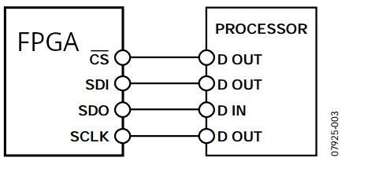
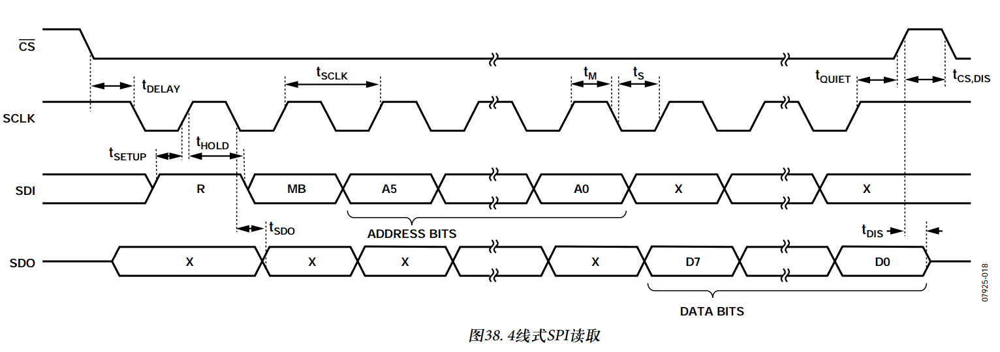
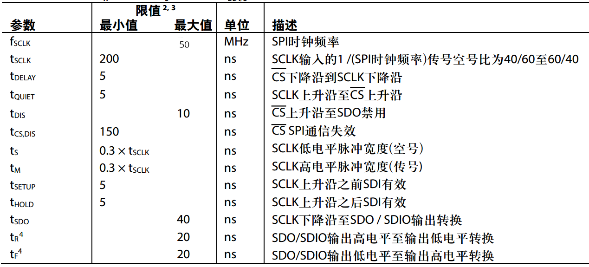

# 颜色识别通信协议

## 硬件连接
| FUNCTION  LOGIC | FPGA PIN | NET/ARDUINO |
| ---------- | :-----------:  | :-----------: |
| spi_clk | H13 | FPGA_AR_SCK  <- AR_SCK |
| spi_in | M5 | FPGA_AR_MOSI <- AR_MOSI |
| spi_out | L5 | FPGA_AR_MISO <- AR_MISO |
| spi_fss | B2 | AR_D10   /SS |
| rst_n | A2 | AR_D9 |
| int1 | B3 | AR_D8 |

FPGA和Arduino 通过SPI进行通信，通信的硬件如上。

## SPI串行通信
对于SPI，使用4线配置，下图所示。最大负载为100 pF时，最大SPI时钟速度为50 MHz，时序方案按照时钟极性(CPOL)= 1、时钟相位(CPHA)= 1执行。CS为串行端口使能线，由SPI主机控制。如图所示，此线必须在传输起点变为低电平，传输终点变为高电平。 SCLK
为串行端口时钟，由SPI主机提供。无传输期间， SCLK为空闲高电平状态。 SDI和SDO分别为串行数据输入和输出。 SCLK下降沿时数据更新， SCLK上升沿时进行采样。

要在单次传输内读取或写入多个字节，必须设置位于第一个字节传输(MB，下图)R /W位后的多字节位。寄存器寻址和数据的第一个字节后，时钟脉冲的随后每次设置(8个时钟脉冲)导致FPGA指向下一个寄存器的读取/写入。时钟脉冲停止后，移位才随之中止， CS失效。要执行不同不连续寄存器的读取或写入，传输之间CS必须失效，新寄存器另行处理

SPI时序：

## 中断
FPGA为驱动中断提供输出引脚： INT1这个中断引脚都是推挽低阻抗引脚。中断引脚默认配置为高电平有效。设置SYS_CON 寄存器(地址0x00)中的D6位，可以更改为低电平有效。所有功能都可以同时使用，但是，一些功能可能需要共享中断引脚。设置SYS_CON寄存器(D2)的适当位，中断使能。

## 寄存器
所有的寄存器都为8位

| D7 | D6 | D5 | D4 | D3 | D2 | D1 | D0 |
| ---------- | :-----------:  | :-----------: | :-----------:  | :-----------: | :-----------:  | :-----------: | :-----------: |
| 0 | 0 | 0 | 0 | 0 | 0 | 0 | 0 |

| 地址 | 名称 | 类型 | 描述 |
| ---------- | :-----------:  | :-----------: | :-----------: |
| 0x00 | SYS_CON | 输入 | D0:系统使能，为0时，开始识别颜色，并且绿灯灭；为1时，识别结束标定物体，可以随物体移动，并且绿灯亮。D1:Reset，为0时处于工作状态，并且红灯灭；为1时，清除之前选定颜色（无法识别颜色），并且红灯亮。 |
| 0x01 | AREA_SIZE | 输入 | 识别框的边长（识别框为正方形） |
| 0x82 | X_DATA_LOW | 输出 | X轴坐标低8位数据 |
| 0x83 | X_DATA_HIGH | 输出 | X轴坐标高8位数据 |
| 0x84 | Y_DATA_LOW | 输出 | Y轴坐标低8位数据 |
| 0x85 | Y_DATA_HIGH | 输出 | Y轴坐标高8位数据 |
| 0x86 | APPROX_VAL | 输出 | 识别颜色的近似度，在标定颜色时指定标定颜色的近似度，在识别颜色时反馈当前识别颜色的近似度，0为完全相近，255为不相近。 |

## 总体流程如下

## 使用说明

1、	屏幕中间有一个正方形的红色框，把要识别的颜色放入框内（建议将框填充满）。

2、	当收到命令0x00时，D0值为1时，绿灯亮，颜色识别结束，整个屏幕内，出现识别的颜色都会被相应的颜色所遮挡，且红色的十字交叉线会随识别区域最大的识别区域中心移动。

3、	当收到命令0x00时，D1值为1时，红灯亮，屏幕正常显示，不会捕捉任何颜色，D0作用失效。

4、	当收到命令0x01时，1中提到的正方形框会根据0x01后面的数据值的大小而改变，数据值的单位为像素点，数据值为正方形的边长。

5、	当收到命令0x82时，会反馈出x轴（横轴）坐标的低8位值。

6、	当收到命令0x83时，会反馈出x轴（横轴）坐标的高8位值。

7、	当收到命令0x84时，会反馈出y轴（纵轴）坐标的低8位值。

8、	当收到命令0x85时，会反馈出y轴（纵轴）坐标的高8位值。

9、	当收到命令0x86时，会反馈出颜色的近似值，0为完全相近，255为不相近。

测试步骤请阅读[Test_procedure.md](Test_procedure.md)